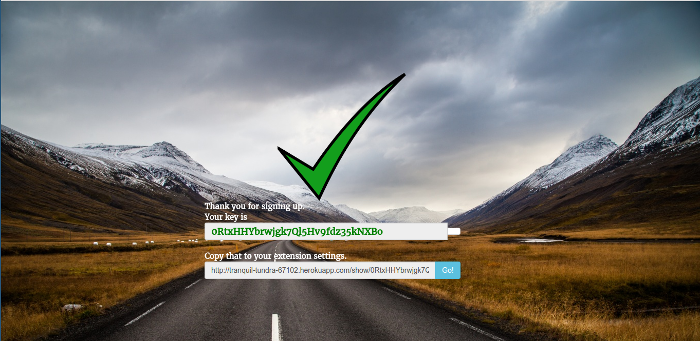
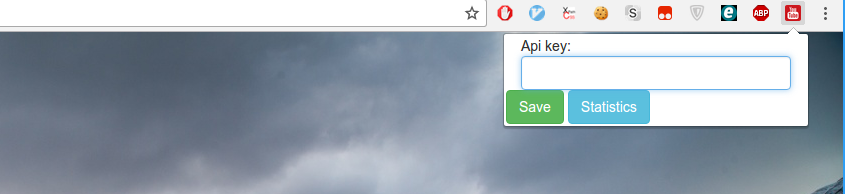
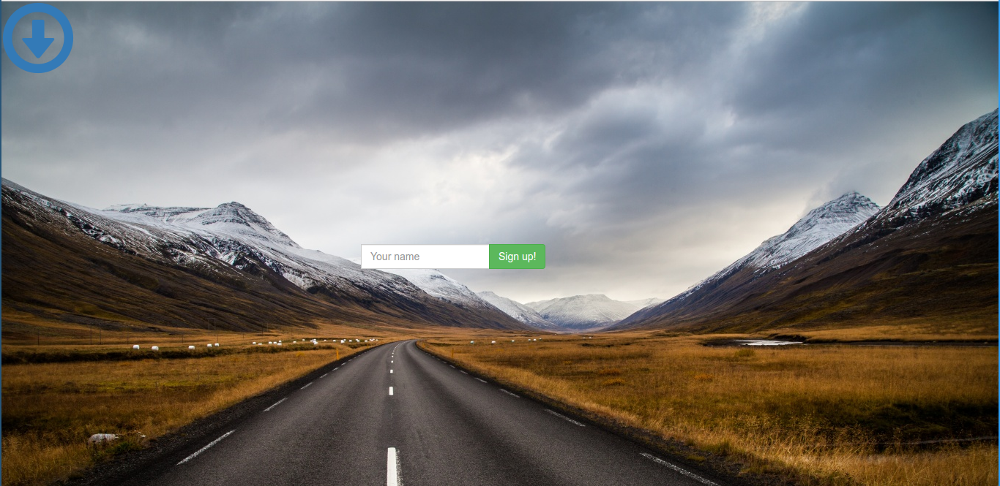
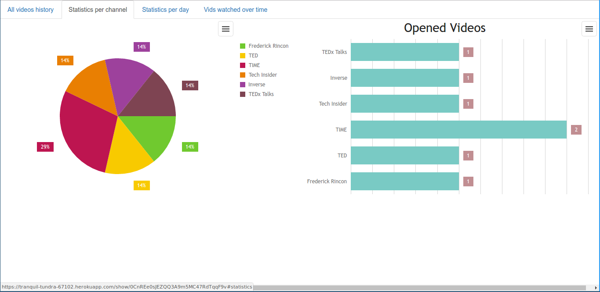
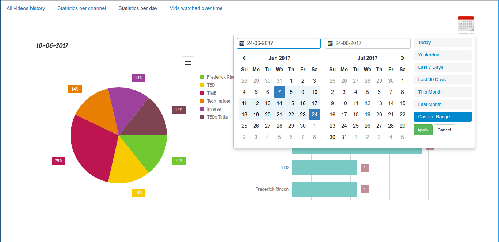

# Youtube analyzer

## Overview
Chrome-extension that'll help you track your time that you spend on Youtube, and content that you watch there.

## How to install
1) Download **YA.crx** at our website and drag it to extensions page in Chrome.
2) Register at https://tranquil-tundra-67102.herokuapp.com/ , copy the key:

3) Paste the key in extension settings and save it.

4) Watch videos and enjoy.

## How to view statistics
Click at extension icon, and then - at **Statistics** button in popup.

## Screenshots

